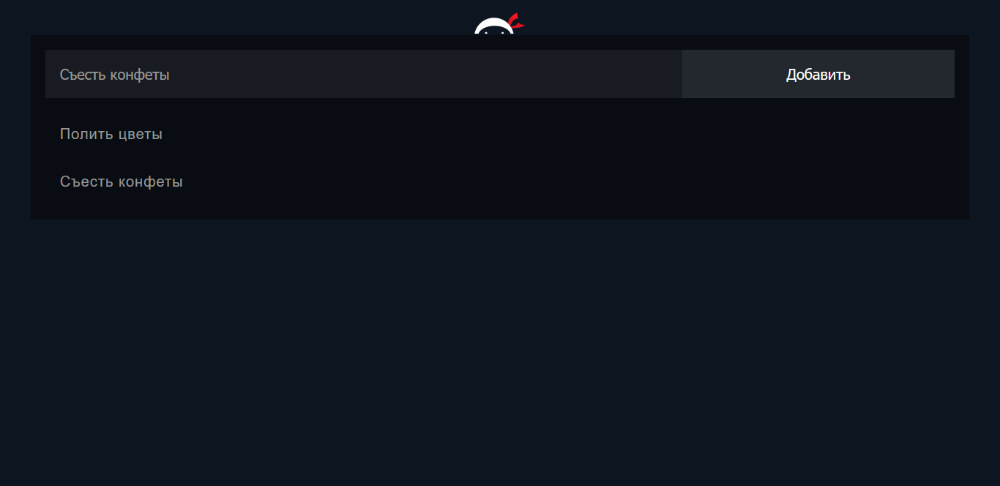

# Простой список задач (TODO) на Node.JS



Приложение написано с помощью фреймворка Express.js. В качестве базы данных использовалась БД MongoDB.

## Как запустить?
Для запуска приложения требуется выполнить установку всех модулей с помощью npm:
```
npm install
```

Запускаем приложение ```./mongod``` через командную строку. Создаем БД и подключаем ее.

Далее выполняем:
```
npm install -g nodemon
nodemon app
```
Приложение запустится на порту 8080:
```
localhost:8080/todo
```

---
Приятного пользования!